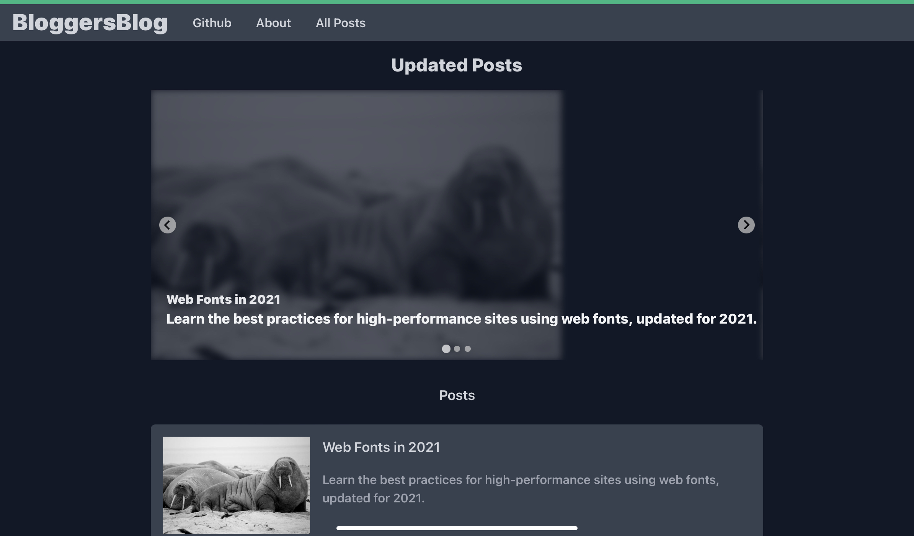

# Bloggy

## Advanced blog made with VueJS and NuxtJS
[Demo](https://blog.mehmetali345.xyz)

# Download beta from releases. Works with vercel and netlify.

- Designed with Windi CSS
  
  - No CSS used. (except some components)

- Custom components 
  
  - Sliders and post cards

## Planned things

- [ ] About Page

- [x] Disqus integration

- [ ] Using Vite

- [x] Multiple authors

 ## Building
 Install packages with yarn or npm (Yarn reccomended)
 ### First
 Run yarn dev or npm install command
 ### Second
 Build site with yarn build or npm build **OR**
 yarn dev or npm install to start development server. 
